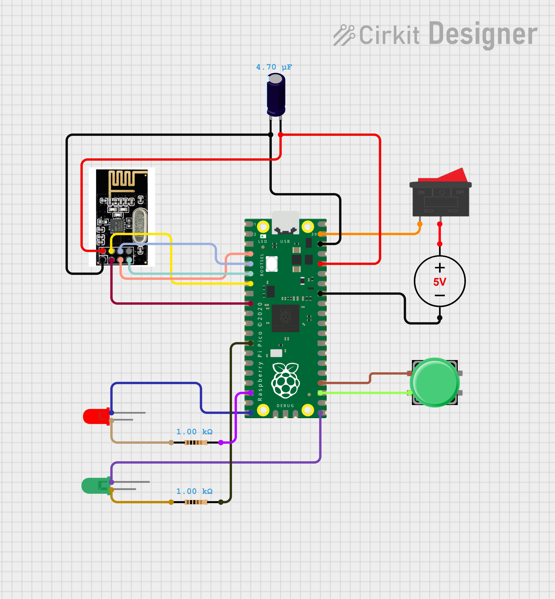
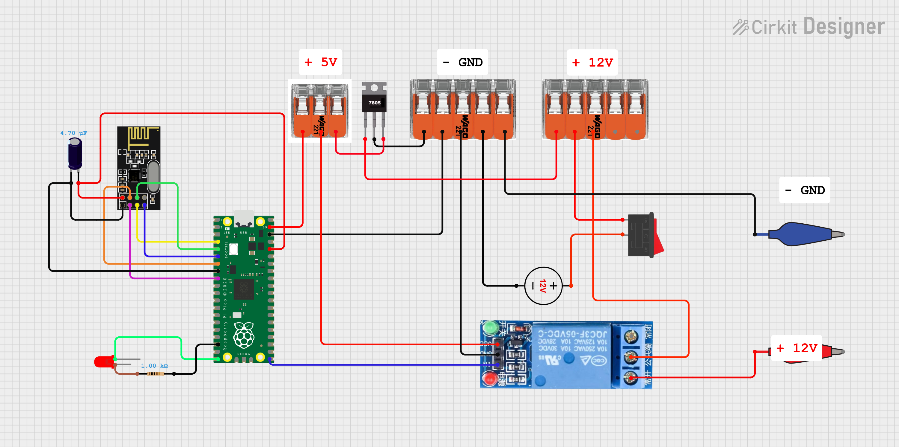

# Zdalny system zapłonu do rakiety

Jest to zdalny system zapłonu do rakiet modelarskich opartych na silnikach na paliwo stałe.  
Składa się z dwóch elementów: pilota i zapalnika. To urządzenie da Ci możliwość zachowania bezpiecznego dystansu  
przy każdym starcie Twojej rakiety. Jest to stosunkowo prosta, ale i niezawodna konstrukcja w odróżnieniu  
od tanich gotowych modułów.  

W repozytorium znajdziesz pliki z programem oraz pliki z **modelem 3D** do wydruku.

## Raspberry PICO Firmware
W zależności jakie masz Raspberry, taki wybierz firmware, jeśli:
- Raspberry PICO WH - RPI_PICO_W-20251209-v1.27.0.uf2
- Raspberry PICO H - RPI_PICO-20251209-v1.27.0.uf2

## Narzędzia

Lista potrzebnych narzędzi:
- Pistolet na gorący klej
- Lutownica + cyna [jeśli jesteś kreatywny, dasz radę bez]
- Drukarka 3D [Służy do zrobienia obudów, można ją zastąpić natynkowymi puszkami elektrycznymi większych rozmiarów]

## Pilot

Jest to urządzenie przenośne, dzięki któremu wysyłasz sygnał zapłonu do zapalnika.

### Lista elementów:
- Moduł nRF24L01+ [Taki z anteną]
- Raspberry Pico H lub W [H EAN: 5056561803180, W EAN: 5056561800196]
- Koszyk na baterie [EAN: 903351248860]
- Włącznik dźwigniowy [EAN: 5904422311650]
- Przycisk [EAN: 5904422304119]
- Dioda LED zielona
- Dioda LED czerwona
- 2x Rezystor 10k ohm [EAN: 5904422329280] - w sumie to byle był jakiś rezystor
- Kondensator elektrolityczny 4,7 uF [EAN: 5903351248303]
- Kable montażowe żeńskie [EAN: 5903351243032]

### Schemat połączeń

### Kod
W kodzie znajdują się zmienne, które można zmienić pod siebie

~~~python
###### Uzupełnij tę sakcje ######
# Zmien ten klucz tak aby zawierał 16 znaków (tak dokładnie 16 znaków)
# klucz musi byc taki sam dla obu urzadzen
klucz = b"rakieta123456789"
# Adresy powinny byc takie same na obu urzadzeniach
# Jesli nie plnujesz brac udzialu w zlach "rakieciarzy" to zmien tylko jeden bajt czyli:
# masz "\xaa" zamien na "\x67" w obu adresach ("\x" to jest staly element tego nie mozesz ruszac
adresy = (b"\x55\xf0\xf0\xf0\xaa", b"\x44\xf0\xf0\xf0\xaa")
#################################
~~~

Z adresami radzę za bardzo nie szaleć, bo potrafi przestać działać. Zalecam zmieniać zgodnie z tym, co powyżej.

## Zapalnik

### Lista elementów
- Moduł nRF24L01+ [Taki z anteną]
- Raspberry Pico H lub W [H EAN: 5056561803180, W EAN: 5056561800196]
- Przekaźnik [EAN: 5903351241229]
- Akumulator AGM 12V 1,2 Ah [EAN: 5902367802523]
- Włącznik dźwigniowy [EAN: 5904422311650]
- Dioda LED zielona lub inna wedle uznania
- Dioda LED czerwona
- 2x Rezystor 10k ohm [EAN: 5904422329280] - w sumie to byle był jakiś rezystor
- Kondensator elektrolityczny 4,7 uF [EAN: 5903351248303]
- Kable montażowe żeńskie [EAN: 5903351243032]
- Kable AWG22 - lub po prostu grubsze kable od tych montażowych w celu podpięcia akumulatora i  
wyprowadzenia zasilania na zapłonnik
- x2 Konektory wsuwane - można zastąpić krokodylkami lub innymi (podłączenie akumulatora)
- x2 Złącza krokodylki
- x2 Złącze WAGO (5 miejsc)
- x1 Złącze WAGO (3 miejsca)

### Schemat połączenia

### Kod

W kodzie znajdują się zmienne, które można zmienić pod siebie.

~~~python
###### Uzupełnij tę sakcje ######
# Zmien ten klucz tak aby zawierał 16 znaków (tak dokładnie 16 znaków)
# klucz musi byc taki sam dla obu urzadzen
klucz = b"rakieta123456789"

# Adresy powinny byc takie same na obu urzadzeniach
# Jesli nie plnujesz brac udzialu w zlach "rakieciarzy" to zmien tylko jeden bajt czyli:
# Zmien "\xaa" na "\x67" w obu adresach ("\x" to jest staly element tego adresu nie mozesz zmieniać)
adresy = (b"\x55\xf0\xf0\xf0\xaa", b"\x44\xf0\xf0\xf0\xaa")

# Podaj ile ma czasu (sekundy) ma zostać podane napięcie na zapalnik!
czas_nagrzewania: float = 3
#################################
~~~

Z adresami radzę za bardzo nie szaleć, bo potrafi przestać działać. Zalecam zmieniać zgodnie z tym, co powyżej.

## Używanie

Należy uruchomić pilot oraz zapalnik włącznikiem, a następnie:
1. Na pilocie znajduje się dioda oznaczona RDY. Ona sygnalizuje, czy pilot połączony jest z zapalnikiem.  
Dioda ta może palić się ciągle lub szybko mrugać, co oznacza stabilne połączenie,  
jednak gdy mrugania będą dłuższe niż 1 sekunda, oznacza to spadek jakości połączenia,  
ale nie oznacza to jego utraty. Dopiero gdy RDY nie będzie się palić, to znak braku połączenia.
2. Po wciśnięciu przycisku dioda RDY powinna zgasnąć na czas ustawiony na zapalniku (domyślnie 3 sec).  
Jest to oznaka, że zapalnik wykonuje polecenie zapłonu.
3. Na zapalniku powinna zapalić się jedna dioda w momencie, gdy jest on włączony, jednak gdy otrzyma on sygnał  
o uruchomieniu zapalnika, zapali się druga na czas podania napięcia na zapłonnik (domyślnie 3 sec),  
następnie gaśnie, co oznacza tryb gotowości.